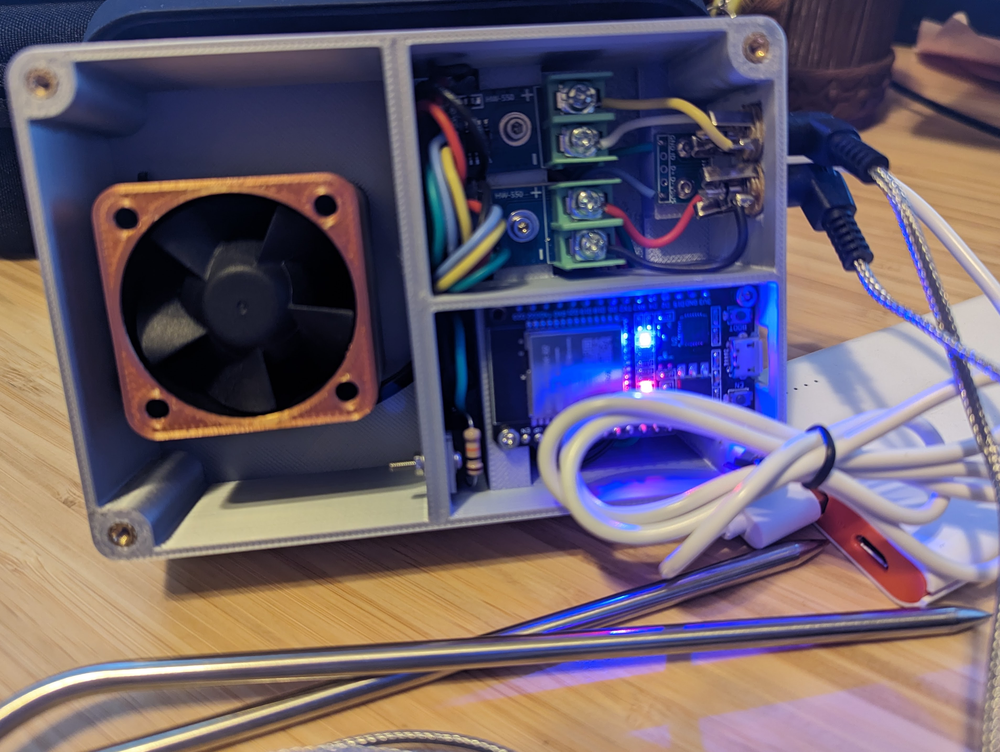
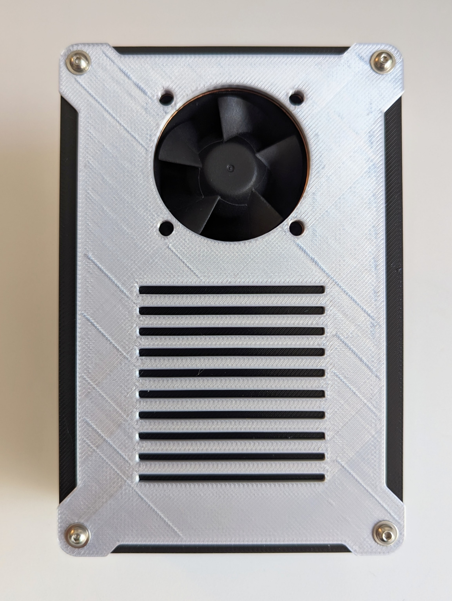
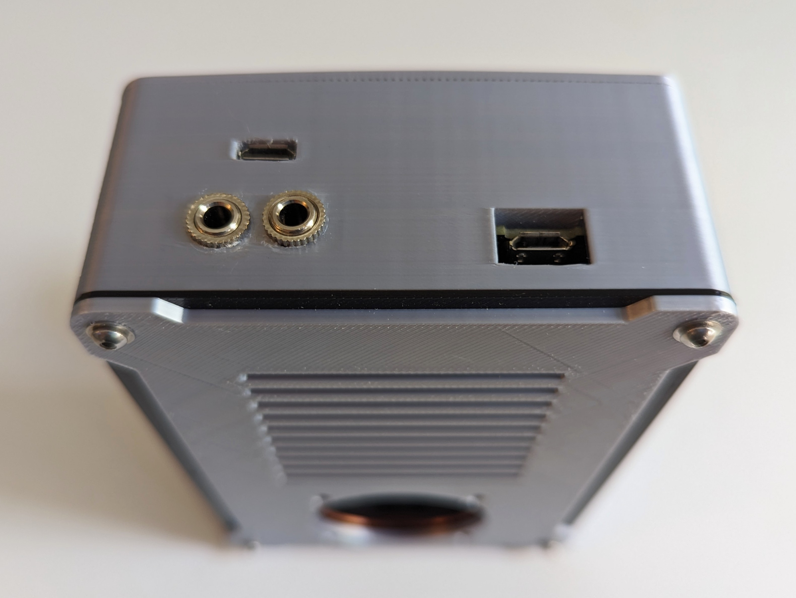
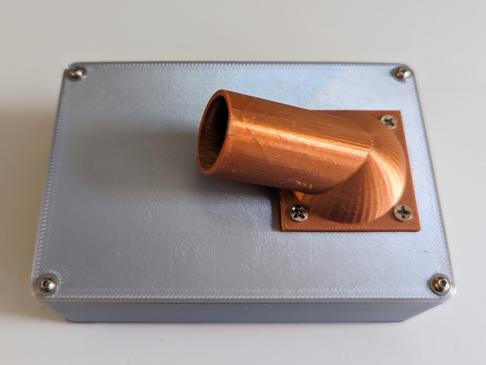
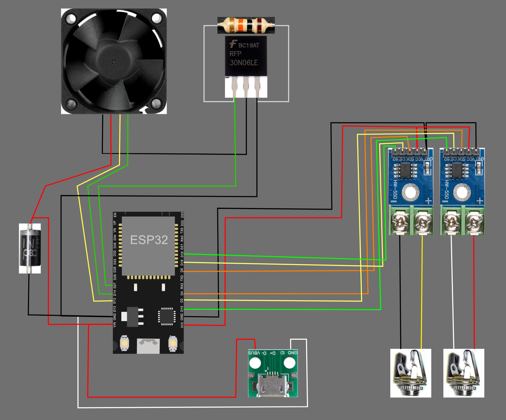

# PitmasterIOT🔥
Blending my passion for technology with the art of BBQing for my loved ones, I embarked on creating the PitmasterIOT. While there are numerous admirable custom and commercial solutions available, I aspired to design something that stands out in its simplicity, affordability, and commitment to being fully open-source.

**Note**: This project is in early preview, and the software is still in development. The UI, PWM fan speed algorithm, and vent connection to the bbq vent, in particular, are works in progress.

## Features
An IoT-enabled device designed specifically for BBQ enthusiasts. This device offers:

- Ambient Temperature Monitoring: Ensures the surroundings are optimal for your BBQ session.
- Food Temperature Tracking: Provides accurate readings of your BBQ's internal temperature, ensuring perfectly cooked meals every time.
- Network Connectivity: Seamlessly connects to your home network, enabling real-time temperature monitoring.
- Interactive Website Interface: All connected devices can access a dynamic website showcasing detailed temperature trends via line charts.
- Integrated Fan System: A compact fan attachment for your BBQ grill, engineered to inject air when necessary. This promotes oxygen circulation, which in turn can intensify the fire and boost heat.
- Smart Heat Management: Employs a sophisticated algorithm that interprets real-time data from the probes, adjusting the fan activity to maintain the desired temperature.

With this device, achieve the perfect BBQ every time by combining traditional grilling methods with modern technology.

 

## Hardware
The 3D components of PitmasterIOT were meticulously designed in Tinkercad.com and printed with my Bambu Lab X1-Carbon. Below is the comprehensive list of parts utilized.

> Note:
> Purchasing every item will result in some extra components

> Disclaimer:
> The amazon product links below are affiliate links, which means that if you choose to make a purchase, I may earn a small commission at no extra cost to you. This commission helps support and maintain the project. I have used and recommend these products because of their quality and not because of the commission I receive from your purchases. All the products below are not required to complete this project, but I wanted to share the exact products that I used in my build.

| Part                                 | Cost        | Links              |
|--------------------------------------|------------:|:------------------------------------:|
| Silver Silk FDM Printer Filament     | $25.99      | [amazon](https://amzn.to/3rPQJBO)    |
| Stainless steel exhaust pipe         | $9.47       | [amazon](https://amzn.to/46Yjta9)    |
| PWM Fan                              | $12.99      | [amazon](https://amzn.to/3rSJSaK)    |
| Esp32                                | $15.99      | [amazon](https://amzn.to/3QoUXtj)    |
| Thermocouple Modules                 | $11.99      | [amazon](https://amzn.to/3QnG6zt)    |
| Themperature Probes                  | $11.99      | [amazon](https://amzn.to/4936Nkb)    |
| MOSFET N-Channel Transistor          | $7.99       | [amazon](https://amzn.to/3tHQZU1)    |
| 10k Ohm Resistor                     | $5.39       | [amazon](https://amzn.to/45EK5Mk)    |
| Flyback Diode                        | $6.97       | [amazon](https://amzn.to/3S6qPUQ)    |
| 3.5mm Socket Jack x2                 | $7.88       | [amazon](https://amzn.to/46FsFAu)    |
| Micro USB female port for 5v input   | $5.89       | [amazon](https://amzn.to/3rZ1vFQ)    |
| 5v Power supply                      | $11.99      | [amazon](https://amzn.to/3Qoaaem)    |
| M2.5 Screws                          | $16.99      | [amazon](https://amzn.to/3S7zbvm)    |
| M2.5 Brass Inserts                   | $9.99       | [amazon](https://amzn.to/3QoW4ct)    |
| **Total**                            | **$169.20** |                                      |

## 3D Printed Enclosure Parts
The following [link](https://makerworld.com/en/models/107291) provides detailed models of the 3D printed enclosure components designed for the PitmasterIOT system.

## Software
Our custom Arduino software powers the PitmasterIOT, which is located in the [src](src) folder. Here's an overview of the integrated libraries:
- **WiFi**: Connect to your WiFi network.
- **ESPAsyncWebServer**: Enables multi-client connections.
- **SPIFFS**: Manages static file storage.
- **Preferences**: Stores persistent configuration key-value pairs.
- **ArduinoJson**: Handles Websocket payloads.
- **Arduino_JSON**: Manages JSON data structures.
- **max6675**: Integrates with the thermocouple.

## Network Integration
The PitmasterIOT hosts a webpage, leveraging Websockets. This ensures instantaneous message transmission and synchronization across all connected devices, providing users with real-time data for a seamless BBQ experience.

## Bidirectional Websocket Events:
- On initial client connection, the server presents HTML/JS/CSS displaying temperature line charts (powered by chart.js).
- Every 5 seconds, the server sends temperature updates to connected clients, refreshing the charts
- Client can publish configuration updates through a dedicated configuration web form

## Schematic
- Thermocouple 0
    - grd: GND
    - vdc: 3v
    - sck: D18 
    - cs:  D5
    - so:  D19
- Thermocouple 1
    - grd: GND 
    - vdc: 3v
    - sck: D15
    - cs:  D2
    - so:  D4
- Micro USB Port
    - grd:  GND
    - vbus: VIN 
- Flyback Diode
    - Anode: 5v
    - Cathode: GND
- 10k Ohm Resistor
    - MOSFET Gate
    - MOSFET Source
- MOSFET N-Channel Transistor
    - Gate: D14
    - Drain: PWM Ground
    - Source: GND
- PWM Fan
    1. Ground: MOSFET Drain
    2. VCC: VIN
    3. Signal: D4
    4. PWM: RX0 

### Discrete Components:
Three discrete components are used, each with a specific purpose: 
1. Flyback Diode:
    - Protects against voltage spikes from inductive loads, specifically to safeguard the PWM fan from sudden interruptions in supply current.
2. 10k Ohm Resistor:
    - Anchors the MOSFET's gate to a known low voltage, averting accidental activation from stray charges or interference, and confirms the MOSFET initializes in the OFF state.
3. MOSFET N-Channel Transistor:
    - Offers exact control over the PWM fan speed and the capability to entirely shut it off, optimizing efficiency and power use.

## Setup Instructions
### 1. Prepare the Enclosure:
- Use the provided Makersworld link to 3D print the three main enclosure parts.
### 2. Circuit Assembly:
- Assemble the circuit as per the given parts list.
### 3. Software Configuration:
- Open the PitmasterIOT.ino file and input your WiFi credentials in the designated area.
- Be sure to select "ESP32 Sketch Data Upload" from the Arduino IDE "Tools" menu. More info [here](https://randomnerdtutorials.com/install-esp32-filesystem-uploader-arduino-ide/).
### 4. Physical Installation:
- Attach the PitmasterIOT's vent to your BBQ grill. Use the recommended exhaust pipe or another heatproof pipe. - Ensure minimal gaps to prevent air leakage.
- Adjust the top vent on your BBQ grill to an almost closed position.
### 5. Powering Up:
- Connect the PitmasterIOT to a 5V power supply.
- Wait for a few moments to allow it to connect to your WiFi network.
### 6. Accessing the Device:
- Identify the device on your network and note its IP address.
- On a computer or mobile device connected to the same WiFi network, enter the device's IP address.
- Depending on the type of probs used you may need to set an adjustment +/- value to calibrate them correctly using the Configuration section on the UI.

**Note**: During your initial sessions with the PitmasterIOT, pay close attention to the heat fluctuations as shown on the line graphs. Aim for minimal variations in temperature. Adjusting the top vent positions can help optimize the heat regulation for your specific BBQ grill.

## Future Directions
We're continually looking to enhance the PitmasterIOT experience. Planned updates include:
- Websocket event storage
- Expanded sensor support
- Enhanced user interfaces
- Home Assistant Integration

## Acknowledgments
Thanks to the open-source community and all BBQ enthusiasts for their insights and encouragement throughout the development of this project. A special mention to [Random Nerd Tutorials](https://randomnerdtutorials.com)  for their invaluable posts that guided and inspired me.

## Contribution & Licensing
We welcome contributions to the PitmasterIOT project. Please see our contribution guidelines for more information. This project is licensed under the MIT License. See the [LICENSE](LICENSE) file for more details.